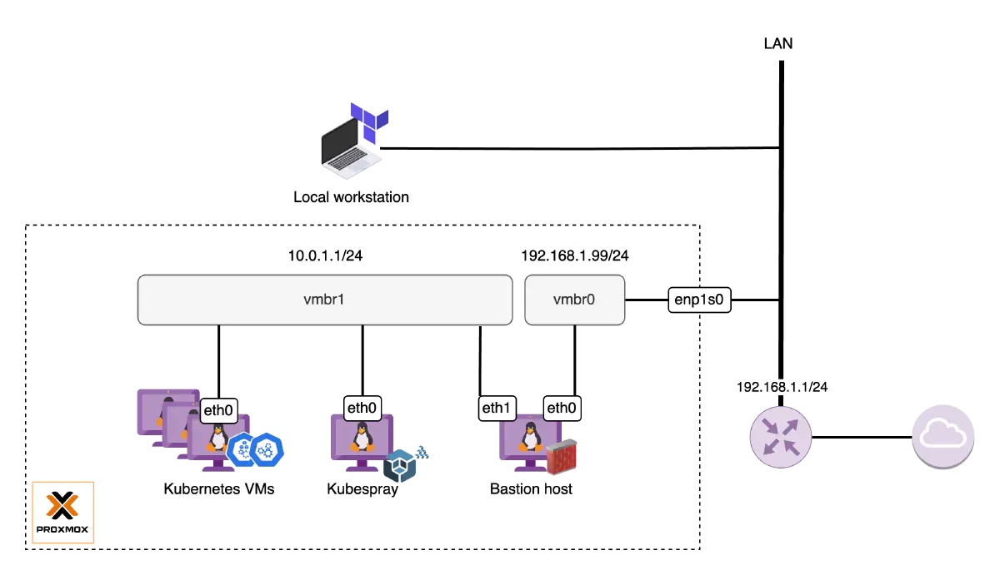

# Homelab

Library for home datacenter project. See the [Services](#services) section for more information on the services included in this deployment guide.

## Installation

### Prerequisites

_*Note:* Steps will be focused on MacOS environment_

1. [Install Terraform](https://developer.hashicorp.com/terraform/tutorials/aws-get-started/install-cli) - Used for general infrastructure provisioning
2. [Install OpenTofu](https://opentofu.org/docs/intro/install/homebrew/) - Used for kubernetes cluster provisioning

### Bootstrap

Provision the initial infrastructure resources in the Proxmox node by running the commands found in the [/bootstrap](./bootstrap/) directory. See the bootstrap [README](./bootstrap/README.md) for more details.

### Initial Service Creation

_*Note:* Make sure your `terraform.tfvars` file contains the correct configuration for your deployments._

To create the initial services outlined above, set up terraform authentication, then apply the terraform modules found in [/terraform](./terraform/) with the following command:

```bash
cd ./terraform && terraform apply
```

## Services

Includes the following services:

- [PiHole DNS Provider](https://pi-hole.net/) - DNS Resolver
- [Home Assistant](https://www.home-assistant.io/) - Home automation hub
- [Nginx Reverse Proxt](https://nginx.org/en/docs/) - Reverse Proxy for custom DNS addressing
- [Tailscale VPN](https://tailscale.com/) - Remote access VPN
- [Uptime Kuma](https://uptime.kuma.pet/) - Service monitoring dashboard
- [Kubernetes Cluster](https://kubernetes.io/docs/home/)
  <!--  -->
  _**Note:** You must install a vmbr1 private network as follows:_
  ```bash
  # /etc/network/interfaces
  ...
  ...
  # Dedicated internal network for Kubernetes cluster
  auto vmbr1
  iface vmbr1 inet static
      address  10.0.1.1/24
      bridge-ports none
      bridge-stp off
      bridge-fd 0

      post-up   echo 1 > /proc/sys/net/ipv4/ip_forward
      post-up   iptables -t nat -A POSTROUTING -s '10.0.1.0/24' -o vmbr0 -j MASQUERADE
      post-down iptables -t nat -D POSTROUTING -s '10.0.1.0/24' -o vmbr0 -j MASQUERADE
  ```

  You will need to reload the networking interface:

  ```bash
  ifreload -a
  ```


## Network Architecture

proxmox 10.9.6.162
kubernetes vmbr0 10.9.6.105/ vmbr1 10.0.1.1/24 mask 255.255.255.0
uptime kuma 10.9.6.103
tailscale vpn 10.9.6.102
pihole 10.9.6.101
nginx proxy 10.9.6.100
home assistant OS (todo - cannot set static IP directly)


---


#### Useful Commands

###### IP Addresses

- Private IP: `ipconfig getifaddr en0`
- Public IP: `dig -4 TXT +short o-o.myaddr.l.google.com @ns1.google.com`
- Both public / private: `ifconfig | grep "inet " | grep -Fv 127.0.0.1 | awk '{print $2}'`
- Find all (?) IPs on network `arp -a`
- List all open ports locally `nc -zv localhost 1-65535 2>&1 | grep succeeded`

###### UPNP Port Forwarding

- List active port forwards: `upnpc -l`
- Add port forward: `upnpc -a <local IP> <private port> <public port> tcp`
- Delete port forward: `upnpc -d <private port> tcp`
-

#### iDRAC Setup

To find the IP of the server, run:

`arp -a`

The IP of the server will be the MAC address: `bc:d0:74:48:dd:38`

Next, start the iDRAC server manager, replacing the `IDRAC_HOST` with the host IP found above.

- Username: `root`
- Password: `calvin`

```bash
docker run -d \
  -p 5801:5800 \
  -p 5901:5900 \
  -e DISPLAY_WIDTH=1920 \
  -e DISPLAY_HEIGHT=1080 \
  -e IDRAC_HOST=10.9.6.131 \
  -e IDRAC_USER=root \
  -e IDRAC_PASSWORD=calvin \
  domistyle/idrac6
```

Open http://localhost:5801/ in your browser to access iDRAC server manager.

Here you can manage BIOS, OS installation, etc.

#### ProxMox

Using iDRAC, choose to boot into Normal system boot. Then, chose `ProxMox VE`. From there, you will login with the following:

ProxMox login:

- Username: `root`

Note that the email address used to sign up is `Andrew_hossack@outlook.com`.

The server is not using a static IP, and instead uses DHCP for IP assignment. TODO - Set up static IP addresses.

To set the webpage IP for proxmox, change the `/etc/network/interfaces` and `/etc/hosts` file to desired default gateway and statix IP values.

Next, Accessible through the web URL https://10.9.6.133:8006/, or whatever IP you had set.

### Nginx Reverse Proxy (10.9.6.165)

We use nginx as a reverse proxy for custom domain names and (eventually) SSL certs using mkcert.

To change and add hosts, modify the `/etc/nginx/sites-available/reverse-proxy.conf ` file to include the new server name. You may need to restart the service with `systemctl reload nginx`.

### Pi Hole DNS (10.9.6.171)

Admin page at http://10.9.6.171/admin

### Tailscale VPN

Username: Andrew_hossack@outlook.com (google login)

### Uptime Kuma Dashboard

### Router Setup

TODO - set up port forwarding for OpenVPN host IP

Set up DHCP reserved range

Move instances to reserved range

TODO - set up more partitions on my sda raid array to accomodate storage, etc for my proxmox storage

---

### Adding custom Service Domains

- Add to nginx configs (see above)
- Add to Local DNS (http://pi.hole/admin/dns_records.php)
